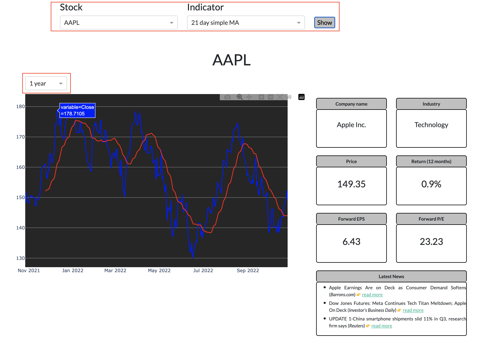

# Stock market monitoring webpage

## Description
This project creates a website to follow the development of stocks and technical indicators. For every stock, data can be displayed for either:
- 1 year;
- year-to-date;
- 1 month; or
- month-to-date.

## Built with
* python
* Plotly / Dash for python
* CSS

## Demo
You can visit the website by going [here](https://stock-monitoring.onrender.com/).

